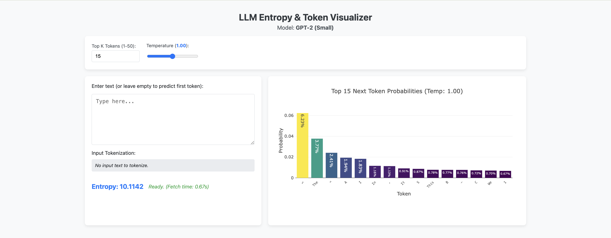

# LLM Entropy Visualizer

App to visualize the entropy of the next token prediction from GPT-2 (124M) as you type. Also shows the probability distribution of the top predicted tokens.



Built with Python, Flask, Hugging Face Transformers, and Plotly.js.

## Setup

1.  **Clone the repository:**
    ```bash
    git clone https://github.com/YOUR_USERNAME/YOUR_REPOSITORY_NAME.git
    cd YOUR_REPOSITORY_NAME
    ```

2.  **Create and activate a virtual environment:**
    ```bash
    python3 -m venv venv
    source venv/bin/activate
    ```
    *(On Windows use: `venv\Scripts\activate`)*

3.  **Install dependencies:**
    ```bash
    pip install -r requirements.txt
    ```

## Running the Application

1.  Ensure your virtual environment is active.
2.  Run the Flask development server:
    ```bash
    python app.py
    ```
3.  Wait for the model to load (check terminal output). This may take a few minutes the first time as the LLM model is downloaded.
4.  Open your web browser and navigate to `http://127.0.0.1:5001`.

## Features
*   Real-time (debounced) entropy calculation for next token predictions.
*   Bar chart visualization of the top N predicted tokens and their probabilities.
*   Uses Hugging Face `transformers` for LLM access (defaults to `gpt2`).
*   Leverages Apple Silicon (MPS) for acceleration if available.
